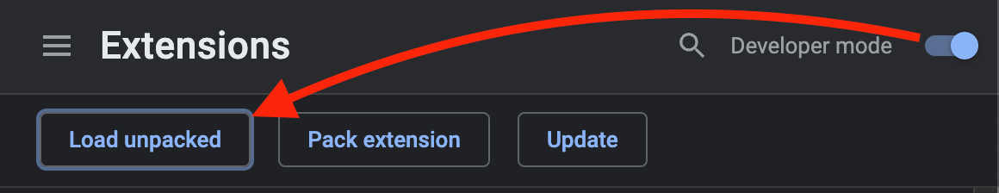
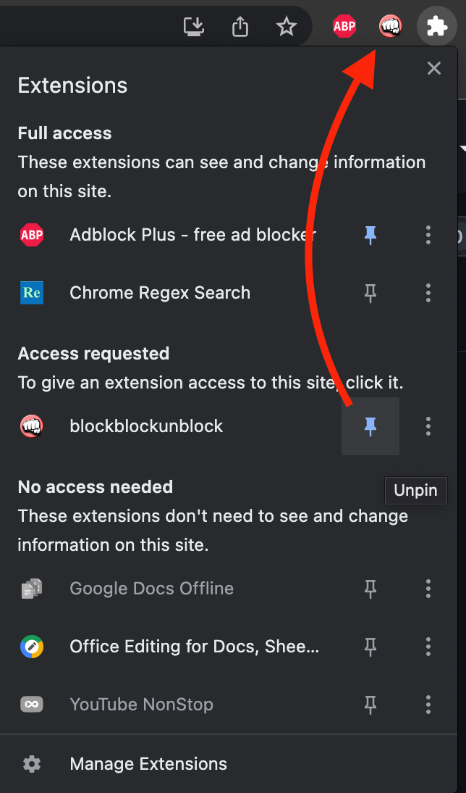

# blockblockunblock
 unblocks blockers blocking adblocks

 Pin this extension and click it when a site tries to force you to turn off your ad blocker.

> 
> Turn on `developer mode` and select the local repo folder.
> 
> 
> Pin the extension and click it to unlock page scrolling and remove overlay modals.
> 